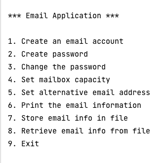

# Email Administration System

## 1. What is the project?

A Console-Based, Menu Driven Email Administration System, built using Java 8.

Its purpose is: 

1. To create user email address / password,
2. Store user information in a text file,
3. Retrieve user information from a text file.

## 2. Installing:

1. Clone the repo

```
https://github.com/AAdewunmi/EmailAdministrationSystem.git
```

2. Open Project Folder


3. Explore (or run) the project. Main class is `/emailapplication/EmailApplication`.

Enjoy 😎

## 3. Screenshots of Main Menu:



## 4. Future Plans:

1. User Interface (UI)
2. Database to store email addresses and passwords
